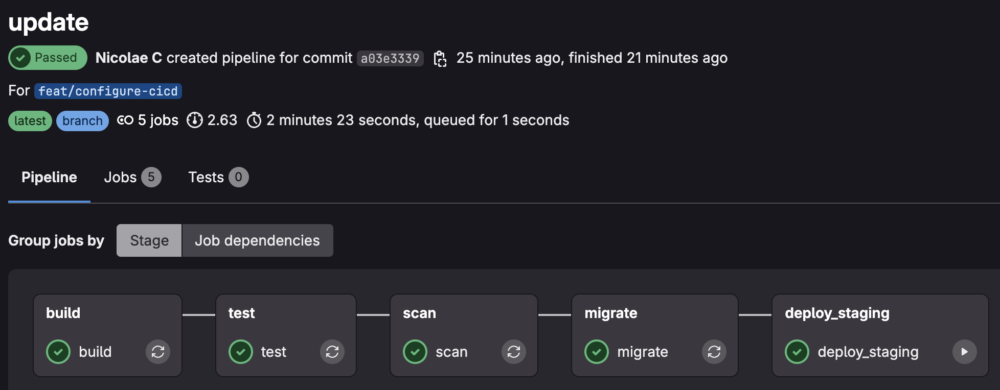

# GitLab pipeline sample

## Overview

This is a gitlab starter pipeline. Main stages include:
- build
- test
- scan
- migrate
- deploy_staging
- (on main) deploy_prod

The deploy stage for production needs to be confirmed before it will run.
The deploy stage for staging will be automatically applied.

## Configuration

### 1. GitLab repo

You will need a gitlab repo for the pipeline to work

### 2. Tests

The test stage is echo, you can add jest, other..

### 3. GCP

#### 3.1 GCP: workload identity pool

This pipeline interacts with GCP for accessing secrets, it uses [Workload Identity Federation](https://cloud.google.com/iam/docs/workload-identity-federation) for allowing GitLab <-> GCP access.
Follow this documentation: [Configure GCP IAM Workload Identity Federation (WIF)](https://docs.gitlab.com/ci/secrets/gcp_secret_manager/#configure-gcp-iam-workload-identity-federation-wif) to access secrets.

#### 3.2 GCP: kubernetes

This pipeline is intended to deploy to GKE cluster. But can use other cloud providers.

## Example Run

